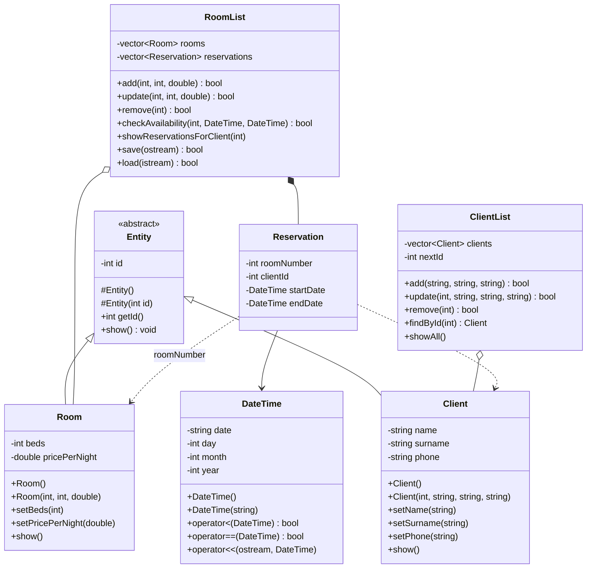

# Diagram klas

```mermaid
classDiagram
    class Entity {
        <<abstract>>
        -int id
        #Entity()
        #Entity(int id)
        +int getId()
        +show() void
    }

    class Client {
        -string name
        -string surname
        -string phone
        +Client()
        +Client(int, string, string, string)
        +setName(string)
        +setSurname(string)
        +setPhone(string)
        +show()
    }

    class Room {
        -int beds
        -double pricePerNight
        +Room()
        +Room(int, int, double)
        +setBeds(int)
        +setPricePerNight(double)
        +show()
    }

    class ClientList {
        -vector~Client~ clients
        -int nextId
        +add(string, string, string) bool
        +update(int, string, string, string) bool
        +remove(int) bool
        +findById(int) Client
        +showAll()
    }

    class RoomList {
        -vector~Room~ rooms
        -vector~Reservation~ reservations
        +add(int, int, double) bool
        +update(int, int, double) bool
        +remove(int) bool
        +checkAvailability(int, DateTime, DateTime) bool
        +showReservationsForClient(int)
        +save(ostream) bool
        +load(istream) bool
    }

    class Reservation {
        -int roomNumber
        -int clientId
        -DateTime startDate
        -DateTime endDate
    }

    class DateTime {
        -string date
        -int day
        -int month
        -int year
        +DateTime()
        +DateTime(string)
        +operator<(DateTime) bool
        +operator==(DateTime) bool
        +operator<<(ostream, DateTime)
    }

    Entity <|-- Client
    Entity <|-- Room
    ClientList o-- Client
    RoomList o-- Room
    RoomList *-- Reservation
    Reservation --> DateTime
    Reservation ..> Client : clientId
    Reservation ..> Room : roomNumber
```
